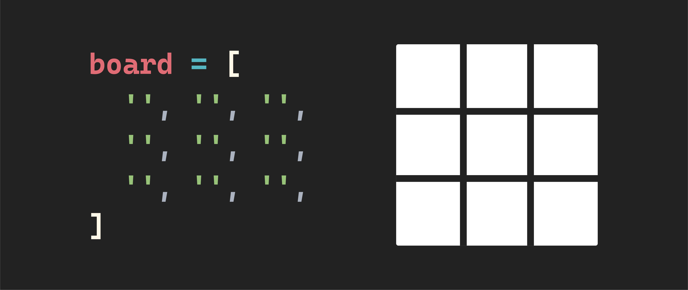
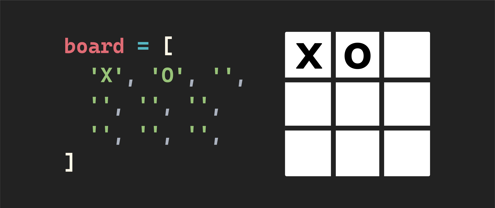

<h1>
  <span class="headline">Tic Tac Toe Lab</span>
  <span class="subhead">Exercise Part 4-5</span>
</h1>

## Step 4

**The state of the game should be rendered to the user.**

a. Create a function called `render`, then set it aside for now.

b. Create a function called `updateBoard`.

c. In the `updateBoard` function, loop over `board` and for each element:

   - Use the current index of the iteration to access the corresponding square in the `squareEls`.

     > 📖 Check out the MDN documentation on `forEach()` to help out with this! What do you have access to in the callback function that could help with this?

   - Style that square however you wish, dependent on the value contained in the current cell being iterated over (`'X'`, `'O'`, or `''`). To keep it simple, start by just putting a letter in each square depending on the value of each cell.

d. Create a function called `updateMessage`.

e. In `updateMessage`, render a message based on the current game state:

   - If both `winner` and `tie` have a value of `false` (meaning the game is still in progress), render whose turn it is.
   - If `winner` is `false`, but `tie` is true, render a tie message.
   - Otherwise, render a congratulatory message to the player that has won.

f. Invoke both the `updateBoard` and the `updateMessage` functions inside your `render` function. 

After completing all of step 4, you should be able to manually change the values held in the `board` array in the `init()` function and see the style of the corresponding square change on your page.

For example, when the board array is a collection of empty strings, you should see something like this:


If the board holds an X and O in the top left and top middle positions, you should see something like this:


## Step 5

**Define the required constants.**

a. In a constant called `winningCombos`, define the eight possible winning combinations as an array of arrays.

   - Want a hint of what this will look like?

     > 💡 To get you started, this will look like:
     >
     > ```js
     > const winningCombos = [
     >   [0, 1, 2],
     >   [3, 4, 5],
     >   // and so on
     > ]
     > ```
     >
     > In this array of arrays, the first array (`[0, 1, 2]`) represents a winning combination on the board's top row. The second array (`[3, 4, 5]`) represents a winning combination on the middle row of the board. Use the above as a scaffolding to build the six remaining winning combinations.

> 🧠 Each array will contain three indices of the board that make a winner if they hold the same player value (`'X'` or `'O'`).
