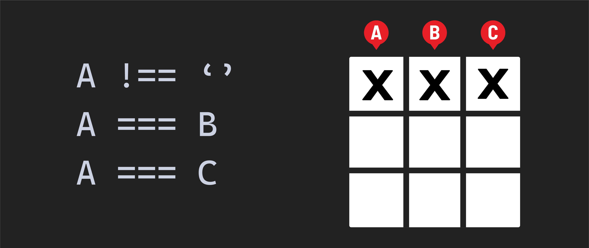

<h1>
  Tic Tac Toe Lab
  Exercise Part 6-7
</h1>

## Step 6

**Handle a player clicking a square with a `handleClick` function.**

a. Create a function called `handleClick`. It will have an `event` parameter.

b. Attach an event listener to the game board using one of the two options below. The first option is the standard path, and the second is the Level Up path.

   ***Ensure you choose only one path.***

   **Option 1:** Add an event listener to each of the existing `squareEls` with a loop. Set up the event listener to respond to the `'click'` event. The event listener should call the `handleClick` function you created in step 6a.

   **Option 2 - Level Up 🚀:** Add a new cached element reference that will allow you to take advantage of event bubbling. Set up an event listener on it that responds to the `'click'` event. On the `'click'` event, it should call the `handleClick` function you created in step 6a. If you use this method, you'll need to ensure the element the user clicks is a square! If they click anywhere else on the board, `return` out of the function to disallow the move. This can be accomplished more easily once you obtain the index of the square clicked in the next step!

c. Obtain the index of the clicked square. To do this, get the index from an `id` assigned to the target element in the HTML. Assign this to a constant called `squareIndex`.

   > 💡 Each `id` corresponds with an index in our `board` array.

d. If the `board` has a value of `'X'` or `'O'` at the `squareIndex` position, immediately `return` out of `handleClick`. That square is already taken. Also, if `winner` is `true`, immediately `return` out of `handleClick` because the game is over.

Next, we will create a collection of smaller functions to break down the remaining functionality of our `handleClick` function. These functions will live in the global scope. They will also be invoked in a specific order inside of our `handleClick` function.

### 6.1 - `placePiece()`

a. Create a function named `placePiece` that accepts an `index` parameter.

b. Update the `board` array at the `index` so that it is equal to the current value of `turn`.

   > 💡 For testing purposes, on the line immediately after you've updated the board array, add a console log of the `board` array.

c. In the `handleClick` function, call the `placePiece` function you just created. Pass `squareIndex` to it as an argument.

   > 💡 If you added a console log above, you should now be able to click spaces on the board, and the corresponding space in the `board` array should change from a `''` to a `'X'`.

### 6.2 - `checkForWinner()`

a. Create a function called `checkForWinner`.

b. Determine if a player has won using one of the two options below. The first option is the standard path, and the second option is the Level Up path.

   ***Ensure you choose only one path.***

   - **Option 1** This option won't take advantage of the `winningCombos` array, but using it as a reference will help you build a solution.

     For each winning combination, you'll check if the first position is something other than an empty string. If it is, you'll check if the value in the first position matches the value in the second position. If it is, you'll check if the value in the first position matches the value in the third position. If it is, then you'll have a winner! Let's break that down step-by-step:

     - Reference the winning combinations you wrote in step 5 and the `board` array. Use the three values in each winning combination to retrieve the values held in those index positions of the `board` array.

     - For example, the first winning combination is `[0, 1, 2]`, representing the top row. Using that winning combination as a guide, you'll need to access the values held in the board array's `0`, `1`, and `2` indexes.

     - Check the following for each of the eight winning combinations:

       - Check to see if the value held in the first position is not an empty string `''`.

       - Also, check to see if the value held in the first position equals the value held in the second position.

       - Also, check to see if the value held in the first position equals the value held in the third position.

       - If those three conditions are all true, then someone has won.

     - If someone has won on any of the eight winning combinations, set `winner` to `true`.

   - **Option 2 - Level Up 🚀** This method takes advantage of the `winningCombos` array you wrote in step 5.

     - Loop through each of the winning combination arrays defined in the `winningCombos` array. Use the three values in each winning combination to retrieve the values held in those index positions of the `board` array.

     - For example, the first winning combination is `[0, 1, 2]`, representing the top row. Using that winning combination as a guide, you'll need to access the values held in the board array's `0`, `1`, and `2` indexes.

     - Check the following for each of the eight winning combinations:

       - Check to see if the value held in the first position is not an empty string `''`.

       - Also, check to see if the value held in the first position equals the value held in the second position.

       - Also, check to see if the value held in the first position equals the value held in the third position.

       - If those three conditions are all true, then someone has won. Set `winner` to `true`.

c. In the `handleClick` function, call the `checkForWinner` function immediately after calling the `placePiece` function.

   > 💡 This function's only job is to determine if there is a winner. For testing purposes, add a console log for `winner` after you've updated the `winner` state.
   >
   > If you click every space that makes up a single winning combination (for example, the top row) on the board, `winner` should become `true`.

### 6.3 - `checkForTie()`

a. Create a function named `checkForTie`.

b. Check if there is a winner. If there is, return out of the function.

c. Check if the `board` array still contains any elements with a value of `''`. If it does, we can leave `tie` as false. Otherwise, `tie` should be set to `true`.

   > 💡 For testing purposes, add a console log for `tie` after you've updated the `tie` state.

d. In the `handleClick` function, call the `checkForTie` function immediately after calling the `checkForWinner` function.

   > 💡 This function's only job is determining if all available moves have been played.
   >
   > If you click every space on the board so that the `board` array no longer has any empty strings (`''`), change the value of `tie` to `true`.

### 6.4 - `switchPlayerTurn()`

a. Create a function called `switchPlayerTurn`.

b. If `winner` is true, return out of the function - we don't need to switch the turn anymore because the person that just played won!

c. If `winner` is false, change the turn by checking the current value of `turn`. If it is `'X'` then change `turn` to `'O'`. If it is `'O'` then change `turn` to `'X'`.

   > 💡 For testing purposes, add a console log for `turn` after you've updated the `turn` state.

d. In the `handleClick` function, call the `switchPlayerTurn` function immediately after calling the `checkForTie` function.

   > 💡 This function's only job is to switch the turn after a player has made a selection and didn't win.
   >
   > If you click a space on the board, `turn` should flip from `'X'` to `'O'` or from `'O'` to `'X'`.

### 6.5 - Tying it all together

a. Finally, now that all the state has been updated, we need to render that updated state to the user by calling the `render` function we wrote earlier.

> 💡 Remember, we use `render` to call upon two other functions (`updateBoard` and `updateMessage`). Both of these functions deal with updating different aspects of the user interface.
>
> Technically, the code in each function could be moved directly inside `render`, but it makes sense to divide this logic based on the area of the user interface being altered.
>
> Your functions should accomplish as specific a task as possible.

## Step 7 - Create Reset functionality

a. Add a reset button to the HTML document. Give it an id of `reset`.

b. Store the new reset button element as a cached element reference in a constant named `resetBtnEl`.

c. Attach an event listener to the `resetBtnEl`. On the `'click'` event, it should call the `init` function you created in step 3.

> 💡 You're done! As a final step, test the game out to ensure everything is working as expected. Consider edge cases, and use console logs to investigate your code if anything is behaving oddly.
>
> Also remove the console logs you added for testing purposes, they should no longer be necessary.
